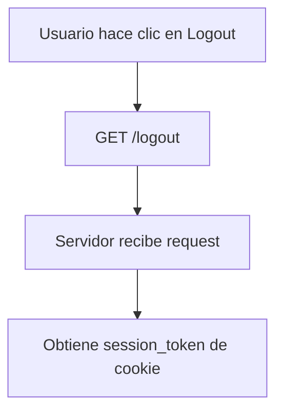
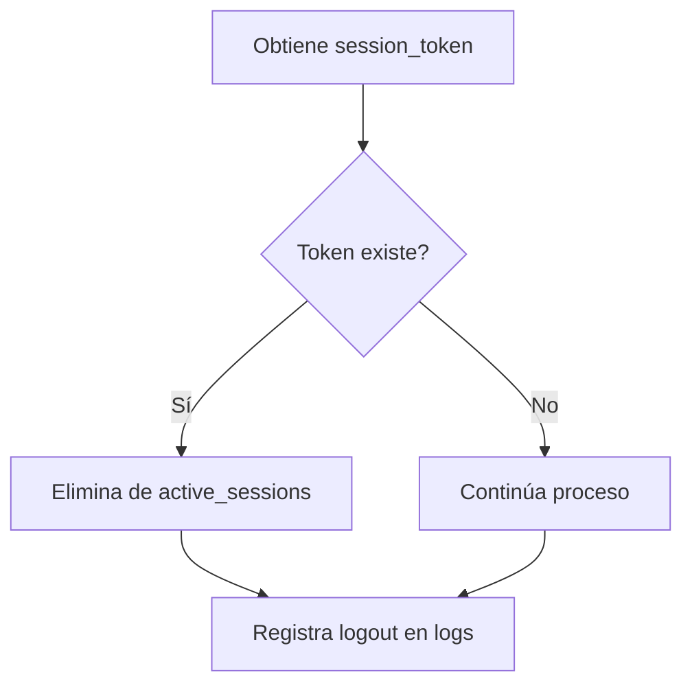
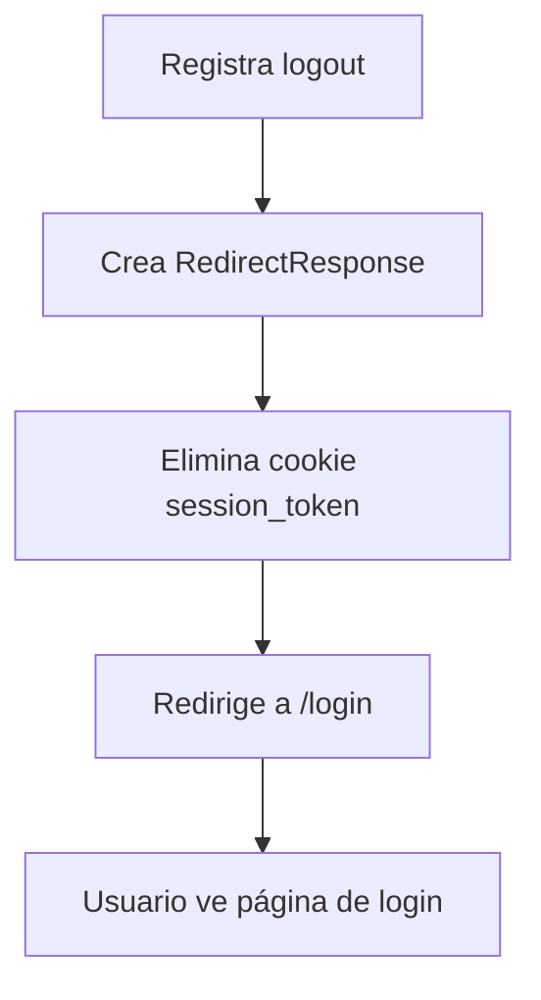

# Sistema de Logout - EIVAI

## 📋 Descripción General

El sistema de logout de EIVAI está diseñado para proporcionar una salida segura del sistema, invalidando completamente la sesión del usuario y limpiando todas las cookies de autenticación.

---

## 🔐 Funcionalidad de Logout

### Ubicación en la Interfaz
El logout está disponible en múltiples ubicaciones para fácil acceso:

1. **Menú de Usuario** (Esquina superior derecha)
   - Dropdown con nombre del usuario
   - Opción "Cerrar Sesión" con icono
   
2. **Navegación Principal**
   - Solo visible para usuarios autenticados
   - Icono de salida claramente identificable

### Proceso de Logout

#### 1. Activación del Logout
```html
<!-- Enlace en el menú dropdown -->
<a class="dropdown-item" href="/logout">
    <i class="fas fa-sign-out-alt me-2"></i>Cerrar Sesión
</a>
```

#### 2. Procesamiento del Servidor
```python
@main_router.get("/logout")
async def logout(request: Request):
    """
    Cerrar sesión del usuario
    
    Proceso:
    1. Obtiene token de sesión de las cookies
    2. Invalida sesión en el servidor
    3. Elimina cookie del navegador
    4. Redirige al login
    """
    # Obtener token de sesión de las cookies
    session_token = request.cookies.get("session_token")
    
    # Invalidar sesión si existe
    if session_token and session_token in active_sessions:
        del active_sessions[session_token]
    
    # Crear respuesta de redirección y limpiar cookie
    response = RedirectResponse(url="/login", status_code=302)
    response.delete_cookie(key="session_token")
    
    return response
```

---

## 🛡️ Características de Seguridad

### 1. Invalidación Completa de Sesión
- **Servidor**: Elimina el token de la memoria activa del servidor
- **Cliente**: Borra la cookie HTTP-only del navegador
- **Base de datos**: Actualiza último acceso del usuario

### 2. Redirección Segura
- Redirige automáticamente al login después del logout
- Previene acceso accidental a páginas protegidas
- Limpia estado de navegación

### 3. Validación de Sesión
```python
# Verificación antes de invalidar
if session_token and session_token in active_sessions:
    # Registrar logout en logs (opcional)
    user_info = active_sessions[session_token]
    print(f"[LOGOUT] Usuario {user_info['username']} cerró sesión")
    
    # Invalidar sesión
    del active_sessions[session_token]
```

---

## 🔄 Flujo Completo de Logout

### Paso 1: Usuario Hace Clic en "Cerrar Sesión"


### Paso 2: Validación y Limpieza


### Paso 3: Respuesta y Redirección


---

## 📱 Experiencia de Usuario

### Indicadores Visuales
- **Icono claro**: `fas fa-sign-out-alt` (puerta de salida)
- **Texto descriptivo**: "Cerrar Sesión"
- **Ubicación consistente**: Siempre en el mismo lugar

### Flujo de Usuario
1. **Usuario autenticado** ve su nombre en la esquina superior derecha
2. **Hace clic** en el dropdown del menú de usuario
3. **Selecciona** "Cerrar Sesión" 
4. **Es redirigido** inmediatamente al login
5. **Ve mensaje** indicando que debe iniciar sesión

### Estados de la Interfaz
```html
<!-- Estado autenticado -->

<li class="nav-item dropdown">
    <a class="nav-link dropdown-toggle" href="#" id="userDropdown" 
       role="button" data-bs-toggle="dropdown">
        <i class="fas fa-user-md me-1"></i>
        {{ user.nombre_completo.split(' ')[0] }}
    </a>
    <ul class="dropdown-menu">
        <li><a class="dropdown-item" href="/perfil">Mi Perfil</a></li>
        <li><hr class="dropdown-divider"></li>
        <li><a class="dropdown-item" href="/logout">Cerrar Sesión</a></li>
    </ul>
</li>

```

---

## ⚙️ Configuración y Personalización

### Tiempo de Sesión
```python
# Configuración en routes.py
SESSION_DURATION = timedelta(hours=8)  # 8 horas por defecto

# Crear sesión con expiración
active_sessions[session_token] = {
    "username": username,
    "login_time": datetime.now(),
    "expires": datetime.now() + SESSION_DURATION
}
```

### Logging de Logout
```python
# Logging detallado (opcional)
def logout_with_logging(request: Request):
    session_token = request.cookies.get("session_token")
    
    if session_token in active_sessions:
        session_info = active_sessions[session_token]
        
        # Log de seguridad
        print(f"[SECURITY] Logout - Usuario: {session_info['username']}")
        print(f"[SECURITY] Login time: {session_info['login_time']}")
        print(f"[SECURITY] Session duration: {datetime.now() - session_info['login_time']}")
        
        del active_sessions[session_token]
```

### Logout Automático
```python
# Logout automático por expiración de sesión
def get_current_user(request: Request):
    session_token = request.cookies.get("session_token")
    
    if session_token in active_sessions:
        session = active_sessions[session_token]
        
        # Verificar expiración
        if datetime.now() > session["expires"]:
            # Auto-logout
            del active_sessions[session_token]
            return None
    
    return user_data
```

---

## 🚨 Casos Especiales

### 1. Logout en Múltiples Pestañas
```javascript
// JavaScript para sincronizar logout entre pestañas (opcional)
window.addEventListener('storage', function(e) {
    if (e.key === 'logout-event') {
        window.location.href = '/login';
    }
});

// Activar evento en logout
localStorage.setItem('logout-event', Date.now());
```

### 2. Logout por Inactividad
```python
# Implementación de timeout por inactividad
INACTIVITY_TIMEOUT = timedelta(minutes=30)

def check_inactivity(session_info):
    last_activity = session_info.get('last_activity', session_info['login_time'])
    
    if datetime.now() - last_activity > INACTIVITY_TIMEOUT:
        return True  # Debe hacer logout
    
    return False
```

### 3. Logout Forzado por Administrador
```python
# Funcionalidad administrativa (futuro)
def force_logout_user(username: str):
    """Fuerza logout de un usuario específico"""
    sessions_to_remove = []
    
    for token, session in active_sessions.items():
        if session['username'] == username:
            sessions_to_remove.append(token)
    
    for token in sessions_to_remove:
        del active_sessions[token]
```

---

## 🧪 Testing del Logout

### Casos de Prueba
1. **Logout normal**: Verificar eliminación de sesión y cookie
2. **Logout sin sesión**: Verificar que no arroje errores
3. **Acceso post-logout**: Verificar redirección a login
4. **Múltiples logouts**: Verificar idempotencia

### Comandos de Prueba
```python
# Test manual con curl
curl -c cookies.txt -d "username=admin&password=admin" -X POST http://localhost:8000/login
curl -b cookies.txt http://localhost:8000/logout -I
curl -b cookies.txt http://localhost:8000/ -I  # Debe redirigir a login
```

---

## 📝 Mejoras Futuras

### 1. Logout con Confirmación
```javascript
// Confirmación antes de logout
function confirmLogout() {
    if (confirm('¿Está seguro que desea cerrar sesión?')) {
        window.location.href = '/logout';
    }
}
```

### 2. Logout con Mensaje Personalizado
```python
# Agregar mensaje de despedida
response = RedirectResponse(url="/login?message=logout_success", status_code=302)
```

### 3. Estadísticas de Sesión
```python
# Mostrar tiempo de sesión al hacer logout
session_duration = datetime.now() - session_info['login_time']
# Agregar a logs o mostrar al usuario
```

---

## 📞 Soporte

Si experimenta problemas con el logout:
1. Verificar que las cookies estén habilitadas
2. Limpiar caché del navegador
3. Verificar conectividad de red
4. Contactar soporte técnico: soporte@eivai.com

---

*Documentación de Logout - EIVAI*
*Actualizado: Mayo 2025*
